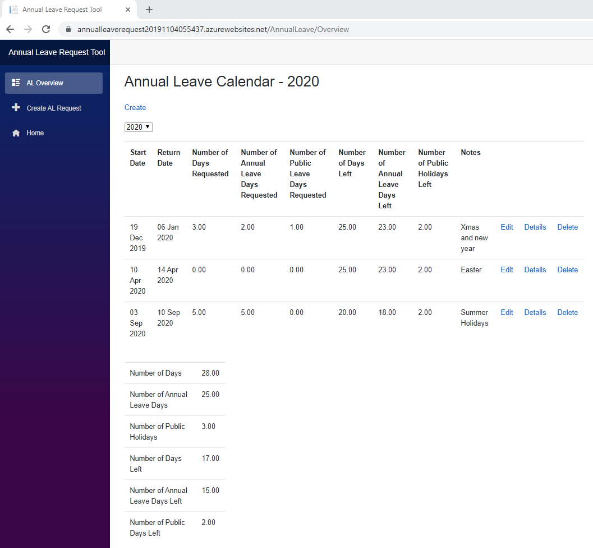
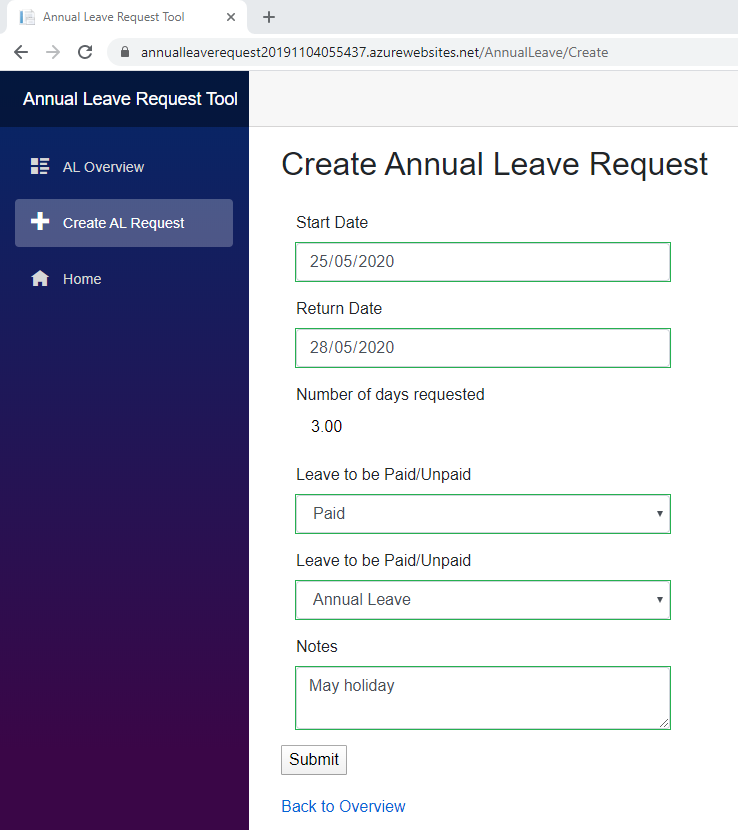
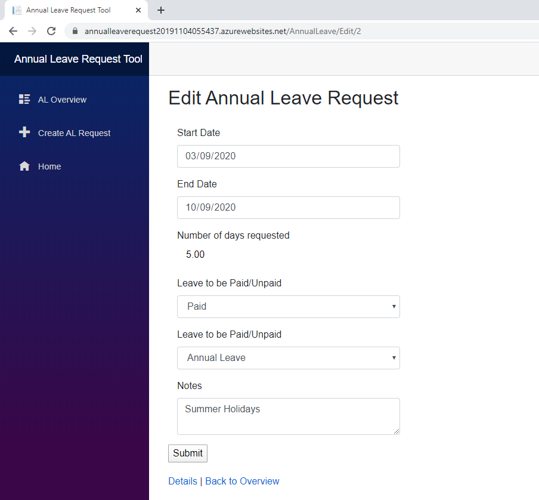

# Blazor Annual Leave Request Tool
Simple Blazor Annual Leave Request Tool

* Allows users to create, update or delete annual leave requests.  
* The Annual leave requests are saved and read from a SQLServer database using Dapper as the ORM.  
* The GUI is developed with Blazor Server/.Net Core 3.1
* There are db scripts used to set up an AnnualLeave DB on SSMS which can be used by the Annual Leave Request tool

## Overview Page

## Create Page

## Edit Page

